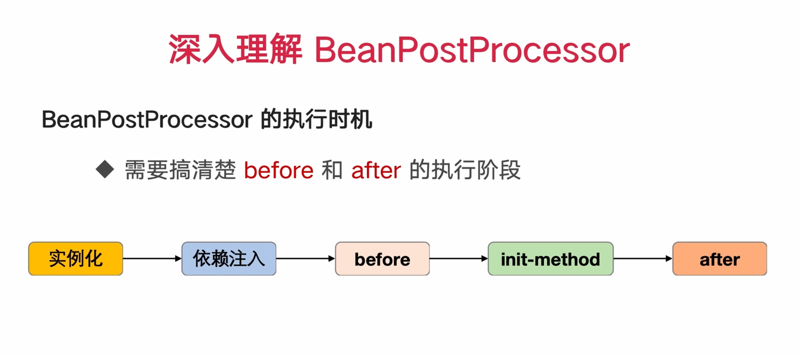
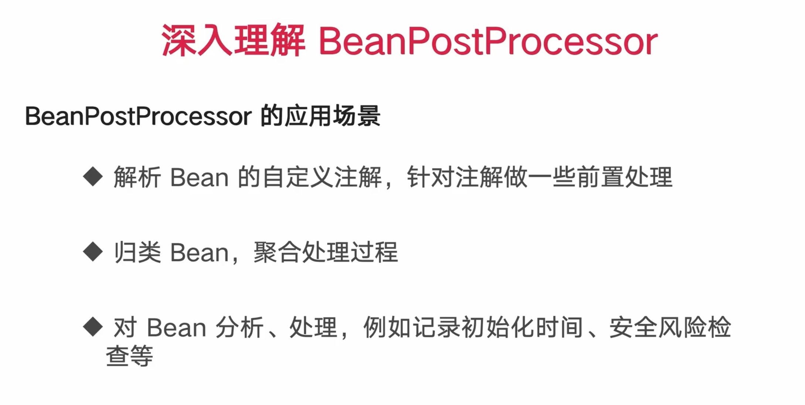

# Bean 与 Spring IOC 学习笔记

> 配套代码：`io.github.leyouhong.java_learner` 下的
> `bean/ImoocBean`（生命周期）、`bean/CustomBeanRegistry` + `bean/MessageHandler`（动态注册）、
> `post/CouponHandlerFactory` + `post/couponhandler/*`（BeanPostProcessor 实战）、
> `circle/ImoocCycleA|B`（循环依赖与三级缓存）、
> `context/ImoocApplicationContextUtilsA|B`（获取容器）、`service/*`（依赖注入）

---

## 一、IOC 到底"反转"了什么

传统写法里，对象的依赖由自己 `new` 出来：

```java
public class AccountServiceImpl {
    private IStorageService storageService = new StorageServiceImpl(); // 自己负责创建
}
```

IOC（Inversion of Control，控制反转）把"创建依赖"这件事从对象自己手里**交给容器**。对象只声明"我需要什么"，不关心"从哪来、怎么造"：

```java
@Service
@RequiredArgsConstructor
public class AccountServiceImpl implements IAccountService {
    private final IStorageService storageService;   // 只声明，不创建
}
```

- **IOC** 是思想：控制权反转给容器。
- **DI**（Dependency Injection，依赖注入）是实现手段：容器把依赖"塞"进来。三种方式——构造器注入（推荐，`@RequiredArgsConstructor` 生成的就是它）、setter 注入、字段注入（`@Autowired` 直接标在字段上，不推荐）。

带来的好处：解耦、易测试（换个实现直接注入 mock）、生命周期统一管理。

---

## 二、Bean 与 Spring 容器的关系

```
┌─────────────────────────┐                    ┌──────────────────────────────┐
│  配置元数据               │                    │   Application                │
│  ┌──────────────────┐   │                    └───────────┬──────────────────┘
│  │ 依赖定义          │   │                                │ ④ getBean()
│  │ (@Autowired)     │   │                                ▼
│  └──────────────────┘   │  ①读取解析      ┌──────────────────────────────────┐
│  ┌───────────┐ ┌──────┐ │ ──────────────▶ │  Spring 容器                     │
│  │ Java 配置类│ │ xml  │ │                 │  ┌────────────────────────────┐  │
│  └───────────┘ └──────┘ │                 │  │ bean 定义注册表             │  │
└─────────────────────────┘                 │  │ beanDefinitionMap（图纸库） │  │
                                            │  └──────────┬─────────────────┘  │
┌─────────────────────────┐   ② 按图纸创建     │             │                    │
│  bean1  bean2  ......    │ ◀───────────────┤             │                    │
└──────────┬──────────────┘                 │  ┌──────────▼─────────────────┐  │
           │  ③ 放入缓存池                    │  │ bean 缓存池                 │  │
           └───────────────────────────────▶ │  │ singletonObjects（成品仓库）│  │
                                            │  └────────────────────────────┘  │
                                            └──────────────────────────────────┘
```

四步走：

1. **读配置** — 容器扫描注解 / 读 Java 配置类 / 解析 xml，把每个 Bean 的"造法"抽象成 `BeanDefinition`，注册进 `beanDefinitionMap`。
2. **按图纸造 Bean** — 反射实例化 → 注入属性 → 初始化。
3. **入缓存池** — 单例 Bean 造好后放进 `singletonObjects`。
4. **应用取用** — `getBean()` 时直接从缓存池拿现货。

关键区分：

| | 是什么 | 存在哪 |
|---|---|---|
| **BeanDefinition** | Bean 的"图纸"（类名、作用域、是否懒加载、依赖关系、初始化方法名…） | `beanDefinitionMap` |
| **Bean 实例** | 按图纸造出来的"成品"对象 | `singletonObjects`（单例才存） |

一份图纸可以造 N 个成品（prototype 作用域），也可以只造一个复用（singleton，默认）。

---

## 三、容器内部：就是两个 Map

`BeanDefinitionRegistry` 定义了注册表接口（`registerBeanDefinition` / `getBeanDefinition` / `getBeanDefinitionCount`…）。它的主力实现 `DefaultListableBeanFactory` 里，注册表的真身就一行：

```java
// DefaultListableBeanFactory
private final Map<String, BeanDefinition> beanDefinitionMap = new ConcurrentHashMap<>(256);
```

成品仓库在父类 `DefaultSingletonBeanRegistry` 里：

```java
// DefaultSingletonBeanRegistry —— 所谓"三级缓存"
private final Map<String, Object> singletonObjects = new ConcurrentHashMap<>(256);        // 一级：成品
private final Map<String, Object> earlySingletonObjects = new ConcurrentHashMap<>(16);    // 二级：半成品的早期引用
private final Map<String, ObjectFactory<?>> singletonFactories = new HashMap<>(16);       // 三级：造早期引用的工厂
```

用 `ConcurrentHashMap` 是因为容器要支持并发 `getBean()`。

> **三级缓存解决的是循环依赖**：A 依赖 B、B 又依赖 A 时，A 实例化后（属性还没注入完）就把自己的"早期引用"塞进三级缓存暴露出去，B 注入时能拿到这个半成品，从而打破死循环。注意它只能解决**单例 + 字段/setter 注入**的循环依赖；构造器注入的循环依赖解决不了，会直接抛 `BeanCurrentlyInCreationException`。
>
> 完整推演见**第七章**——包括为什么必须是三级而不是两级，以及 Spring Boot 2.6+ 为什么默认把它关掉了。

---

## 四、getBean 的骨架

先看简化版，抓住主干：

```java
Object getBean(String beanName) {
    // 1. 先看成品仓库有没有现货
    Object bean = singletonObjects.get(beanName);
    if (bean != null) {
        return bean;
    }

    // 2. 没有 -> 去图纸库拿图纸
    BeanDefinition bd = beanDefinitionMap.get(beanName);
    if (bd == null) {
        throw new NoSuchBeanDefinitionException(beanName);
    }

    // 3. 按图纸造：反射 new -> 注入属性 -> 初始化
    bean = createBean(beanName, bd);

    // 4. 放回成品仓库，下次直接走第 1 步
    singletonObjects.put(beanName, bean);

    return bean;
}
```

### 对应到真实源码：`AbstractBeanFactory#doGetBean`

真实流程比上面多了不少分支，但主干完全一致：

```
doGetBean(name, requiredType, args, typeCheckOnly)
│
├─ 1. transformedBeanName(name)
│     去掉 FactoryBean 的 "&" 前缀、把别名解析成规范 beanName
│
├─ 2. getSingleton(beanName)              ← 对应简化版第 1 步「查现货」
│     依次查 singletonObjects → earlySingletonObjects → singletonFactories
│     命中 → getObjectForBeanInstance()（若是 FactoryBean 则调 getObject()）→ 返回
│
├─ 3. 没命中：
│     ├─ isPrototypeCurrentlyInCreation() → 抛循环依赖异常
│     ├─ 父容器有这个 Bean？→ 委托给 parentBeanFactory.getBean()
│     ├─ markBeanAsCreated(beanName)
│     ├─ getMergedLocalBeanDefinition(beanName)   ← 对应「拿图纸」，会合并父子 BeanDefinition
│     ├─ 先递归 getBean() 把 dependsOn 声明的依赖创建出来
│     │
│     └─ 按 scope 分支：
│         ├─ singleton  → getSingleton(beanName, () -> createBean(...))   ← 造完自动 put 进一级缓存
│         ├─ prototype  → 每次都 createBean(...)，不缓存
│         └─ 其他 scope → scope.get(beanName, () -> createBean(...))
│
└─ 4. adaptBeanInstance()：必要时做类型转换，返回
```

`createBean` 往下走到 `AbstractAutowireCapableBeanFactory#doCreateBean`，这才是真正"造"的地方：

```
doCreateBean
├─ createBeanInstance()    反射调构造器，得到裸对象（此时属性全是 null）
├─ addSingletonFactory()   把早期引用放进三级缓存（为循环依赖做准备）
├─ populateBean()          依赖注入：@Autowired / @Value / setter 全在这一步
└─ initializeBean()        初始化（见下一节）
```

---

## 五、Bean 的生命周期

`initializeBean()` 内部的顺序，正是 `ImoocBean` 打出来的日志顺序：

```java
// AbstractAutowireCapableBeanFactory#initializeBean（简化）
invokeAwareMethods(beanName, bean);                                   // BeanNameAware / BeanFactoryAware ...
wrappedBean = applyBeanPostProcessorsBeforeInitialization(bean, ...); // 所有 BPP 的 before
invokeInitMethods(beanName, wrappedBean, mbd);                        // afterPropertiesSet() → init-method
wrappedBean = applyBeanPostProcessorsAfterInitialization(bean, ...);  // 所有 BPP 的 after
```

完整生命周期：

```
实例化 (createBeanInstance, 反射调构造器)
   ↓
属性注入 (populateBean)
   ↓
Aware 回调 (BeanNameAware / BeanClassLoaderAware / BeanFactoryAware)
   ↓
BeanPostProcessor#postProcessBeforeInitialization
   └─ @PostConstruct 在这里被调用！(由 CommonAnnotationBeanPostProcessor 触发)
   └─ ApplicationContextAware#setApplicationContext 也在这里 (由 ApplicationContextAwareProcessor 触发)
   ↓
InitializingBean#afterPropertiesSet
   ↓
@Bean(initMethod = "xxx") 指定的初始化方法
   ↓
BeanPostProcessor#postProcessAfterInitialization
   └─ AOP 代理就是在这一步生成的
   ↓
      ★ Bean 可用 ★
   ↓
容器关闭 → @PreDestroy → DisposableBean#destroy() → @Bean(destroyMethod = "xxx")
```

### 对照 `ImoocBean` 的实际日志

```
postProcessBeanDefinitionRegistry                                 ← BDRPP，比任何业务 Bean 都早（见第八章）
ImoocBean init                                                    ← @PostConstruct
ImoocBean afterPropertiesSet                                      ← InitializingBean
postProcessBeforeInitialization, bean is instanceof IAccountService
postProcessAfterInitialization, bean is instanceof IAccountService
MessageHandler imoocMultiMessageHandler_qinyi started             ← initMethodName（见第八章）
Started JavaLearnerApplication in 0.423 seconds
=========== 容器启动完成 ===========
ImoocBean = io.github.leyouhong.java_learner.bean.ImoocBean@2bf94401
UtilsA context == ctx ? true
UtilsB context == ctx ? true
=========== 准备关闭容器 ===========
MessageHandler imoocMultiMessageHandler_qinyi stopped             ← destroyMethodName
bean destroy                                                      ← @PreDestroy
=========== 容器已关闭 ===========
```

**两个容易困惑的点：**

1. **为什么 `@PostConstruct` 打在 `afterPropertiesSet` 前面？**
   因为 `@PostConstruct` 并不是一个独立阶段，它是由 `CommonAnnotationBeanPostProcessor`（继承自 `InitDestroyAnnotationBeanPostProcessor`）在 **`postProcessBeforeInitialization` 里**调用的，天然早于 `afterPropertiesSet`。

2. **为什么 `ImoocBean` 自己的 init 日志排在最前面，比 `AccountService` 的 BPP 日志还早？**
   因为 `ImoocBean` 同时实现了 `BeanPostProcessor`。容器在 `refresh()` 的 `registerBeanPostProcessors()` 阶段会**提前实例化所有 BeanPostProcessor**，远早于普通业务 Bean。所以它先被造出来（打 init / afterPropertiesSet），之后才轮到它去加工 `AccountServiceImpl`。

   ⚠️ 副作用：BeanPostProcessor 本身不会被其他 BPP 加工，也不能享受 AOP、`@Autowired` 之外的一些高级特性，且它提前实例化会连带把它依赖的 Bean 也提前造出来。**生产代码里不要把 BeanPostProcessor 和普通业务 Bean 写在同一个类里**，`ImoocBean` 这种写法仅适合学习演示。

### `@PreDestroy` 为什么需要 try-with-resources

`SpringApplication.run()` 返回的 `ConfigurableApplicationContext` 实现了 `AutoCloseable`。普通 `main` 方法跑完就退出，不会触发容器关闭钩子，`@PreDestroy` 就看不到日志。所以代码里写成：

```java
try (ConfigurableApplicationContext ctx = SpringApplication.run(JavaLearnerApplication.class, args)) {
    // ...
}   // 出了这个代码块自动 close() → 触发 @PreDestroy
```

Web 应用不需要这么写，因为容器会常驻，JVM 关闭时由 shutdown hook 负责调用 `close()`。

---

## 六、深入理解 BeanPostProcessor：优惠券分发实战

第五章把 BPP 当作生命周期里的两个钩子介绍过。这一章换个视角：**BPP 能拿来干什么**——配套代码是 `post/` 包下的优惠券分发器。

### 6.1 执行时机：before 和 after 到底卡在哪



```
实例化 ──▶ 依赖注入 ──▶ before ──▶ init-method ──▶ after
```

这是第五章那张完整生命周期图的压缩版，"init-method" 一格实际包含了 `@PostConstruct` → `afterPropertiesSet` → `initMethod` 三档。要点只有一个：**before 时依赖已经注好但还没初始化，after 时 Bean 已经完全初始化（AOP 代理也是在 after 阶段生成的）**。

### 6.2 应用场景：BPP 是"对所有 Bean 的拦截器"



BPP 会被容器对**每一个** Bean 调用（第五章的表格：BFPP 整个容器一次，BPP 每个 Bean 都调），所以它天然适合做"横切所有 Bean"的事：

1. **解析 Bean 上的自定义注解**，针对注解做处理——本章 demo 干的就是这个；Spring 自己的 `@Autowired`（`AutowiredAnnotationBeanPostProcessor`）、`@PostConstruct`（`CommonAnnotationBeanPostProcessor`）也是这么实现的。
2. **归类 Bean，聚合处理**——把散落在容器里的同类 Bean 收集到一处（本章 demo 的另一半）。
3. **对 Bean 做分析、加工**——记录初始化耗时、安全风险检查、替换成代理对象（AOP 就是最大的用户）。

### 6.3 实战：优惠券分发器

**业务背景**：优惠券有满减、满返、折扣等多种类型，每种处理逻辑不同。朴素写法是一坨 `if/else` 或 `switch`；拆成多个实现类后，调用方又得自己挑实现——"按类型找处理器"这件事总得有人做，而且**每加一种券就要改一次分发代码**。

**思路**：策略模式 + 自定义注解 + BPP 归类。每个处理器自己声明"我处理哪种券"，工厂利用 BPP 在**容器启动期**自动收集，调用方只管拿：

```
CouponTypeEnum          券类型枚举（MAN_JIAN / MAN_FAN / ZHE_KOU）
@CouponHandlerProcessor 自定义注解：标在处理器上，声明"我处理哪种券"
ICouponHandlerService   处理器接口（process()）
XxxServiceImpl × 3      三个实现类，各自标注解
CouponHandlerFactory    工厂 = BeanPostProcessor：启动期收集，运行期分发
```

处理器这边，加一种券 = 加一个类，**不改任何现有代码**：

```java
@Slf4j
@Service
@CouponHandlerProcessor(CouponTypeEnum.MAN_JIAN)   // 声明：我处理满减券
public class ManJianICouponHandlerServiceImpl implements ICouponHandlerService {
    @Override
    public void process() {
        log.info("处理满减券");
    }
}
```

工厂这边，核心就是"每个 Bean 路过时看一眼是不是处理器"：

```java
@Slf4j
@Component
public class CouponHandlerFactory implements BeanPostProcessor {

    private final Map<CouponTypeEnum, ICouponHandlerService> serviceMap = new ConcurrentHashMap<>();

    @Override
    public Object postProcessAfterInitialization(Object bean, String beanName) {
        if (bean instanceof ICouponHandlerService handler) {
            // findAnnotation 会穿透 CGLIB 代理、查父类层级，比 clazz.getAnnotation 更稳
            CouponHandlerProcessor annotation =
                    AnnotationUtils.findAnnotation(bean.getClass(), CouponHandlerProcessor.class);
            if (annotation == null) {
                throw new IllegalStateException("[" + beanName + "] 缺少 @CouponHandlerProcessor 注解");
            }
            ICouponHandlerService prev = serviceMap.putIfAbsent(annotation.value(), handler);
            if (prev != null) {
                throw new IllegalStateException("优惠券类型 " + annotation.value() + " 被重复注册");
            }
            log.info("绑定 coupon 处理器 {} -> {}", annotation.value(), beanName);
        }
        return bean;   // 别忘了返回 bean！返回 null 后续 BPP 就收不到了
    }

    public ICouponHandlerService getHandler(CouponTypeEnum type) { ... }
}
```

调用方完全不知道有几种券、几个实现类：

```java
couponFactory.getHandler(type).process();
```

### 6.4 三个容易踩的坑

**① 注册要放在 after，不是 before。**
回看 6.1 的时序：AOP 代理在 **after 阶段**才生成。如果在 `postProcessBeforeInitialization` 里注册，map 里存的是**裸对象**——今天没事,哪天给处理器加了 `@Transactional` / `@Async`，通过 map 调用就**绕过了代理**，事务静默失效，极难排查。在 after 注册，收进来的才是最终形态。

> 严格说 after 也不是绝对保险（多个 BPP 之间还有顺序问题，见 6.6），但比 before 安全得多。

**② 注解判空 + 重复注册校验。**
`clazz.getAnnotation()` 在"实现了接口却忘标注解"时返回 null，直接 `annotation.value()` 就是 NPE，而且是**启动期**的 NPE 还好，如果没人立刻触发就成了运行期地雷。显式判空抛 `IllegalStateException`，把配置错误钉死在启动阶段。同理，两个处理器声明同一种券类型时 `put` 会静默覆盖，用 `putIfAbsent` + 抛异常暴露出来。

**③ 用 `AnnotationUtils.findAnnotation` 而不是 `clazz.getAnnotation`。**
Bean 被 CGLIB 代理后 `bean.getClass()` 是代理子类，注解在父类上，`getAnnotation` 可能拿不到（除非注解标了 `@Inherited`）；`findAnnotation` 会沿着代理、父类、接口层级找。

### 6.5 实测日志

```
ImoocBean init
ImoocBean afterPropertiesSet
绑定 coupon 处理器 MAN_FAN -> manFanICouponHandlerServiceImpl      ← 启动期：BPP 逐个收集
绑定 coupon 处理器 MAN_JIAN -> manJianICouponHandlerServiceImpl
绑定 coupon 处理器 ZHE_KOU -> zheKouICouponHandlerServiceImpl
...
Started JavaLearnerApplication in 0.454 seconds
=========== 容器启动完成 ===========
...
处理满减券                                                          ← 运行期：按类型分发
处理满返券
处理折扣券
```

注意绑定日志出现在**启动阶段**、`Started` 之前——收集是容器造 Bean 时顺手完成的，运行期查 map 零成本。另外 `CouponHandlerFactory` 本身是 BPP，会像第五章说的那样**提前实例化**（在 `registerBeanPostProcessors()` 阶段）——正因为它先就位，后面创建的每个处理器 Bean 它才都能看到。

### 6.6 多个 BPP 的执行顺序：`Ordered` 接口

容器里从来不止一个 BPP（`ImoocBean`、`CouponHandlerFactory`，还有 Spring 内置的一堆）。谁先谁后由 `Ordered` 接口决定：

```java
// org.springframework.core.Ordered
public interface Ordered {
    int HIGHEST_PRECEDENCE = Integer.MIN_VALUE;   // 最高优先级
    int LOWEST_PRECEDENCE  = Integer.MAX_VALUE;   // 最低优先级

    int getOrder();
}
```

规则（Javadoc 原文的意思）：

- **值越小优先级越高**（类比 Servlet 的 load-on-startup）。
- **order 值相同，顺序不保证**（arbitrary sort positions）。
- 还有个子接口 `PriorityOrdered`，比所有普通 `Ordered` 都靠前。

`registerBeanPostProcessors()`（`PostProcessorRegistrationDelegate`）注册 BPP 时按三档分组，依次注册：

```
① 实现 PriorityOrdered 的     ← 组内按 getOrder() 排序（Spring 内置的基本在这档，
                                 如 AutowiredAnnotationBeanPostProcessor）
② 实现 Ordered 的             ← 组内按 getOrder() 排序
③ 什么都没实现的               ← 注册顺序，不保证
```

`ImoocBean` 和 `CouponHandlerFactory` 都没实现 `Ordered`，落在第 ③ 档——它俩之间的先后**不保证**。当前 demo 里两者互不干扰所以无所谓；一旦你的 BPP 之间有依赖（比如一个 BPP 要处理另一个 BPP 注册的东西），就必须实现 `Ordered` 显式声明顺序。也可以直接用 `@Order` 注解，但注意：**对 BPP 本身，`@Order` 注解不生效，必须实现 `Ordered` 接口**——`PostProcessorRegistrationDelegate` 分档用的是 `isTypeMatch(ppName, Ordered.class)` 这样的类型检查，只标注解的 BPP 会落进"什么都没实现"那档，压根不参与排序。

### 6.7 一个诚实的补充：不用 BPP 也能做到

这个场景其实有个更常见的写法——Spring 原生支持**按类型注入全部实现**：

```java
@Component
@RequiredArgsConstructor
public class CouponHandlerFactory {
    private final List<ICouponHandlerService> handlers;   // 容器自动注入全部 3 个实现
    private final Map<CouponTypeEnum, ICouponHandlerService> serviceMap = new EnumMap<>(CouponTypeEnum.class);

    @PostConstruct
    public void init() {
        for (ICouponHandlerService handler : handlers) {
            CouponHandlerProcessor anno = AnnotationUtils.findAnnotation(handler.getClass(), CouponHandlerProcessor.class);
            serviceMap.put(anno.value(), handler);
        }
    }
}
```

不用当 BPP、不被提前实例化、没有第五章警告的那些副作用，日常业务代码**优先用这种**。BPP 版的价值在于理解框架：`@Autowired`、`@PostConstruct`、AOP……Spring 的大半注解魔法都是 BPP 干的，亲手写一个才知道魔法从哪来。

两者的本质区别：BPP 是"**Bean 路过我这里时**我处理它"（推模式），`List` 注入是"**容器造完后**我去要全部"（拉模式）。功能等价，侵入性不同。

---

## 七、循环依赖与三级缓存：`ImoocCycleA` ←→ `ImoocCycleB`

第三章列出了三个 Map，第四章讲了 `doCreateBean` 的四步。把这两件事合起来看，就能推出循环依赖为什么能解、以及**为什么只能解一半**。

### 7.1 循环依赖是什么

两个（或多个）Bean 互相需要对方：

```java
@Service
public class ImoocCycleA {
    @Autowired
    private ImoocCycleB b;
}

@Service
public class ImoocCycleB {
    @Autowired
    private ImoocCycleA a;
}
```

朴素地想，这是个死锁：造 A 要先有 B，造 B 又要先有 A。第四章那个简化版 `getBean` 会直接无限递归下去。

### 7.2 两种循环依赖：一种能解，一种解不了

关键区别在于**依赖是在"实例化"时要，还是在"实例化之后"要**。回看 `doCreateBean` 的四步：

```
doCreateBean
├─ createBeanInstance()    ← 构造器注入的依赖在这里就要
├─ addSingletonFactory()   ← 早期引用在这里才暴露出去
├─ populateBean()          ← 字段 / setter 注入的依赖在这里才要
└─ initializeBean()
```

**暴露早期引用这一步，夹在两者中间**。这一行时序决定了一切：

| | 依赖在哪一步被索取 | 那时早期引用暴露了吗 | 结果 |
|---|---|---|---|
| **字段 / setter 注入** | `populateBean()` | ✅ 上一步刚暴露 | **能解** |
| **构造器注入** | `createBeanInstance()` | ❌ 还没走到暴露那步 | **解不了** |

构造器注入的循环无解，因为"半成品"这个概念本身不存在——对象连 `new` 都还没 `new` 出来，没有任何东西可以拿去暴露。

> 补一句：三级缓存还有两个前提——**必须是单例**（prototype 不进缓存池，`doGetBean` 一进来就 `isPrototypeCurrentlyInCreation()` 抛异常），且**不能是 `@Async` 之类会在初始化后换掉对象的场景**（见 7.6）。

### 7.3 能解的那种：三级缓存的完整推演

以 A、B 都用字段注入为例，全程只有一个线程：

```
getBean(A)
│
├─ getSingleton("A") → 三个 Map 全空 → 没现货
├─ 标记 A 正在创建 (singletonsCurrentlyInCreation.add("A"))
├─ createBean(A) → doCreateBean(A)
│   ├─ createBeanInstance(A)     → new ImoocCycleA()，此时 a.b == null      【裸对象】
│   ├─ addSingletonFactory("A")  → 三级缓存 singletonFactories["A"] = () -> A的早期引用
│   ├─ populateBean(A)           → 发现要注入 B，于是 getBean(B) ↓↓↓
│   │   │
│   │   ├─ getSingleton("B") → 全空 → 没现货
│   │   ├─ 标记 B 正在创建
│   │   ├─ createBean(B) → doCreateBean(B)
│   │   │   ├─ createBeanInstance(B)    → new ImoocCycleB()，b.a == null
│   │   │   ├─ addSingletonFactory("B")
│   │   │   ├─ populateBean(B)          → 要注入 A，于是 getBean(A) ↓↓↓
│   │   │   │   └─ getSingleton("A", allowEarlyReference=true)
│   │   │   │       ├─ 一级 singletonObjects["A"]      → 没有（A 还没造完）
│   │   │   │       ├─ 二级 earlySingletonObjects["A"] → 没有（第一次拿）
│   │   │   │       └─ 三级 singletonFactories["A"]    → 命中！★ 循环在这里被打破
│   │   │   │           ├─ factory.getObject() → 拿到 A 的早期引用
│   │   │   │           ├─ 升级：earlySingletonObjects["A"] = 早期引用
│   │   │   │           └─ 降级：singletonFactories.remove("A")
│   │   │   │       ⇒ B 拿到了「属性还没注入完的 A」，注入成功
│   │   │   ├─ initializeBean(B)        → B 完整可用
│   │   │   └─ 放入一级缓存 singletonObjects["B"] = B，清掉 B 的二三级
│   │   └─ ⇒ A 拿到了完整的 B，注入成功
│   ├─ initializeBean(A)         → A 完整可用
│   └─ 放入一级缓存 singletonObjects["A"] = A
└─ 返回 A
```

一句话概括：**A 把"还没装修完的自己"提前挂出去，B 先拿着这个引用把自己造完；等 B 造完回到 A，A 再继续装修。因为是单例、大家持有的是同一个对象引用，A 后续装修的结果 B 自动就看到了。**

最后一句是整个机制成立的前提——B 拿到的不是 A 的拷贝，是**同一个对象的引用**。所以 B 持有它的那一刻 `a.b == null`，等 A 走完 `populateBean` 之后，B 手里那个 A 的 `b` 字段自动就有值了。

`getSingleton` 查三级的顺序对应源码 `DefaultSingletonBeanRegistry#getSingleton(String, boolean)`（Spring 6.x 起加了 `singletonLock`，逻辑不变）：

```java
Object singletonObject = this.singletonObjects.get(beanName);                    // 一级
if (singletonObject == null && isSingletonCurrentlyInCreation(beanName)) {
    singletonObject = this.earlySingletonObjects.get(beanName);                  // 二级
    if (singletonObject == null && allowEarlyReference) {
        // ... 加锁、再查一遍 ...
        ObjectFactory<?> singletonFactory = this.singletonFactories.get(beanName);   // 三级
        if (singletonFactory != null) {
            singletonObject = singletonFactory.getObject();
            if (this.singletonFactories.remove(beanName) != null) {
                this.earlySingletonObjects.put(beanName, singletonObject);       // 三级升二级
            }
        }
    }
}
```

注意 `isSingletonCurrentlyInCreation(beanName)` 这个前置条件：**只有"正在创建中"的 Bean 才允许走二三级**。这也是循环依赖检测的依据——如果一个 Bean 正在创建、又被人来要，说明成环了。

### 7.4 为什么要三级？两级不够吗

这是最常被问的一题。假设砍掉三级，`createBeanInstance` 之后直接 `earlySingletonObjects.put(beanName, 裸对象)`——**在没有 AOP 的情况下确实够用**。三级存在的意义只有一个：**给 AOP 代理留一个"按需、且只生成一次"的时机**。

三级缓存里存的不是对象，是个工厂：

```java
addSingletonFactory(beanName, () -> getEarlyBeanReference(beanName, mbd, bean));
```

`getEarlyBeanReference` 会遍历所有 `SmartInstantiationAwareBeanPostProcessor`（AOP 的 `AnnotationAwareAspectJAutoProxyCreator` 就是其中之一），**该代理的返回代理对象，不该代理的原样返回裸对象**。

于是：

- **懒**——没人来要，工厂就永远不执行，不会为了"万一有循环依赖"给每个 Bean 都提前造代理。
- **只造一次**——工厂执行完，结果升到二级、三级删掉。后面再有 C 也依赖 A，从二级直接拿到**同一个**代理，不会造出第二个。

如果只有两级，就必须在实例化后立刻决定"要不要代理"，等于把 AOP 从 `postProcessAfterInitialization`（第五章）提前到实例化阶段，破坏了生命周期语义。

> 顺带解释了第五章一个细节：正常情况下 AOP 代理在 `postProcessAfterInitialization` 生成；一旦发生循环依赖，代理会被**提前**在 `getEarlyBeanReference` 里生成。Spring 用 `AbstractAutoProxyCreator.earlyProxyReferences` 记账，保证后面 `postProcessAfterInitialization` 不会重复代理。

三个 Map 的分工，回到第三章那张表：

| 缓存 | 字段 | 存什么 | 何时写入 | 何时清除 |
|---|---|---|---|---|
| 一级 | `singletonObjects` | 完整可用的成品 | Bean 全部初始化完 | 容器销毁 |
| 二级 | `earlySingletonObjects` | 已生成的早期引用（可能是代理） | 三级工厂被执行后 | 升到一级时 |
| 三级 | `singletonFactories` | 生成早期引用的工厂 | `createBeanInstance` 之后 | 被执行后 / 升到一级时 |

### 7.5 Spring Boot 2.6+ 默认禁止循环依赖

上面讲的机制一直都在，但**从 Spring Boot 2.6 开始默认关掉了**（本项目 Boot 4.1 仍然如此）。原因在 `doCreateBean` 这一行：

```java
// AbstractAutowireCapableBeanFactory
boolean earlySingletonExposure = (mbd.isSingleton() && this.allowCircularReferences &&
        isSingletonCurrentlyInCreation(beanName));
if (earlySingletonExposure) {
    addSingletonFactory(beanName, () -> getEarlyBeanReference(beanName, mbd, bean));
}
```

`allowCircularReferences` 为 `false` 时，**三级缓存根本不写入**，字段注入的循环也一样会失败。要打开就在 `application.yml` 里：

```yaml
spring:
  main:
    allow-circular-references: true
```

等价写法还有 `SpringApplication.setAllowCircularReferences(true)` 和 `new SpringApplicationBuilder().allowCircularReferences(true)`。

> Spring 官方把默认值改成 `false` 是有意的：循环依赖能跑通不代表设计合理，它通常是职责划分不清的信号，而且会让 Bean 的初始化顺序变得难以推理。**这个开关的正确用法是"给遗留代码升级留个缓冲"，不是长期方案。**

### 7.6 实测：两种循环的真实表现

配套代码 `circle/ImoocCycleA` + `circle/ImoocCycleB` 就是这一章的实验场，两种形态切一下注释就能互换。

**① 字段注入 + 开关打开 → 启动成功**

```
Started JavaLearnerApplication in 0.433 seconds
=========== 容器启动完成 ===========
A.hello() -> 我持有的 B = io.github.leyouhong.java_learner.circle.ImoocCycleB@dc7b462
B.hello() -> 我持有的 A = io.github.leyouhong.java_learner.circle.ImoocCycleA@1f51431
A.b == b ? true, B.a == a ? true          ← 双方持有的就是对方那个单例
```

最后一行是 7.3 那句"大家持有的是同一个对象引用"的直接证据。

**② 构造器注入（开关照样打开）→ 启动失败**

```java
@Service
public class ImoocCycleA {
    public ImoocCycleA(ImoocCycleB b) { }   // 换成构造器注入
}
```

```
UnsatisfiedDependencyException: Error creating bean with name 'imoocCycleA':
  Unsatisfied dependency expressed through constructor parameter 0:
  Error creating bean with name 'imoocCycleB':
    Unsatisfied dependency expressed through constructor parameter 0:
    Error creating bean with name 'imoocCycleA':
      Requested bean is currently in creation: Is there an unresolvable circular reference ...

***************************
APPLICATION FAILED TO START
***************************

The dependencies of some of the beans in the application context form a cycle:

┌─────┐
|  imoocCycleA
↑     ↓
|  imoocCycleB
└─────┘

Action:
Despite circular references being allowed, the dependency cycle between beans could not be broken.
Update your application to remove the dependency cycle.
```

**`Despite circular references being allowed`** 这句话是关键——它说明开关确实生效了，只是三级缓存对构造器循环无能为力，印证了 7.2 的表格。

> 报错里那张 `┌─→┐` 环形图由 `BeanCurrentlyInCreationFailureAnalyzer` 生成，会把整条依赖链画出来，排查多个 Bean 组成的长环时很好用。

**③ 另一个开关救不了的场景：`@Async`**

如果循环里某个 Bean 标了 `@Async`，即便是字段注入也会失败：

```
BeanCurrentlyInCreationException: Bean with name 'xxx' has been injected into other beans [yyy]
in its raw version as part of a circular reference, but has eventually been wrapped.
```

因为 `@Async` 的代理是 `AsyncAnnotationBeanPostProcessor` 在 `postProcessAfterInitialization` 里加的，它不参与 `getEarlyBeanReference`。别人早就拿走了裸对象，最后成品却被换成了代理——`doCreateBean` 末尾的一致性校验发现"你们拿到的和我最终返回的不是一个对象"，直接报错。

### 7.7 该怎么办：优先级从高到低

1. **重构掉环**（首选）。循环依赖基本都是职责放错了位置，常见解法：
   - 把 A、B 共用的那部分抽成第三个 Bean `C`，改成 A→C ←B；
   - 或者把"A 调 B"改成事件驱动（`ApplicationEventPublisher` 发事件，B 监听），把编译期依赖变成运行时解耦。
2. **`@Lazy`**——救构造器循环的标准手段：

   ```java
   public ImoocCycleA(@Lazy ImoocCycleB b) { }
   ```

   注入进来的是个代理，真正调用方法时才去容器取实例，所以 `createBeanInstance` 阶段不需要真的 B。**不需要开 `allow-circular-references`。**
3. **`ObjectProvider<B>` / `ApplicationContext`**——把"拿依赖"从注入时推迟到用的时候，思路和 `@Lazy` 一样但更显式：

   ```java
   private final ObjectProvider<ImoocCycleB> bProvider;
   public void hello() { bProvider.getObject().doSomething(); }
   ```
4. **改成字段 / setter 注入 + 打开开关**——本章 demo 用的就是这条，最省事但也最不推荐：环还在，只是被容器兜住了。

> 别忘了第一章的结论：**构造器注入是推荐做法**。它连"循环依赖"这种设计问题都能在启动期直接暴露出来，反而是它的优点——字段注入的问题会被三级缓存悄悄咽下去。

---

## 八、动态注册 Bean：`CustomBeanRegistry` + `MessageHandler`

前面几章都在讲"容器怎么读你的注解、造出 Bean"。这一章反过来：**跳过注解，自己画图纸、自己往注册表里塞**。

### 8.1 为什么需要它

`@Component` / `@Bean` 有个硬限制：**一个类 / 一个方法，只能对应一个 Bean**。

但有些场景，"要造几个、每个的构造参数是什么"只有**运行时**才知道：

- 配置文件里列了 5 个 Kafka topic，每个 topic 要一个独立的消费线程 handler
- 多数据源：`application.yml` 里配了 N 个库，每个库要一套 DataSource + JdbcTemplate
- 插件化：扫描到几个插件 jar，就注册几个处理器

这时注解写死不了——你总不能提前写 5 个 `@Bean` 方法。解决办法就是：**在容器启动早期，程序化地往 `beanDefinitionMap` 里注册 N 份 `BeanDefinition`**。

这正是这两个类在演示的事，也是第三章"容器内部就是两个 Map"的动手版——你亲手往图纸库里 put 了一条。

### 8.2 两个类的分工

| 类 | 角色 | 关键特征 |
|---|---|---|
| `MessageHandler` | **产品**（被造的那个） | ⚠️ **没有任何 Spring 注解**，就是个普通 POJO |
| `CustomBeanRegistry` | **图纸的绘制者 + 注册者** | 实现 `BeanDefinitionRegistryPostProcessor` |

先看产品：

```java
@Slf4j
public class MessageHandler {          // 注意：没有 @Component！
    private final String handlerName;
    private final IAccountService accountService;
    private final ExecutorService executorService;

    public MessageHandler(String handlerName, IAccountService accountService, ExecutorService executorService) { ... }

    public void start() { log.info("MessageHandler {} started", handlerName); }
    public void close() { log.info("MessageHandler {} stopped", handlerName); }
}
```

三个构造参数刚好覆盖了三种典型情况，后面注册时要分别处理：

| 参数 | 类型 | 值从哪来 |
|---|---|---|
| `handlerName` | 字面量 | 直接给字符串——**这是每个实例不同的部分** |
| `accountService` | 容器里的 Bean | 得"引用"另一个 Bean |
| `executorService` | 手动创建的对象 | 直接 new 一个实例塞进去 |

`start()` / `close()` **不是任何接口的方法**，它俩之所以会被自动调用，纯粹是因为在 `BeanDefinition` 里被指定成了初始化 / 销毁方法（见 8.4）。这和 xml 时代的 `<bean init-method="start" destroy-method="close"/>` 是一回事。

### 8.3 `BeanDefinitionRegistryPostProcessor`：在"造 Bean"之前改图纸

```java
@Configuration
public class CustomBeanRegistry implements BeanDefinitionRegistryPostProcessor {

    @Override
    public void postProcessBeanDefinitionRegistry(BeanDefinitionRegistry registry) {
        String beanName = buildBeanName("ginyi");
        BeanDefinition definition = buildBeanDefinition("qinyi");
        registry.registerBeanDefinition(beanName, definition);   // ← 往 beanDefinitionMap 里 put
        log.info("postProcessBeanDefinitionRegistry");
    }
    // ...
}
```

`registry.registerBeanDefinition(...)` 这一行，就是第三章那个 `beanDefinitionMap.put(beanName, bd)`。`BeanDefinitionRegistry` 正是你笔记里提到的那个接口。

**执行时机**——实测启动日志里，`postProcessBeanDefinitionRegistry` 是**第一条应用日志**，比 `ImoocBean init` 还早：

```
i.g.l.j.bean.CustomBeanRegistry  : postProcessBeanDefinitionRegistry     ← 最早
i.g.l.java_learner.bean.ImoocBean: ImoocBean init
...
i.g.l.java_learner.bean.MessageHandler: MessageHandler ... started
```

原因在 `AbstractApplicationContext#refresh()` 的顺序：

```
refresh()
├─ invokeBeanFactoryPostProcessors()
│   ├─ BeanDefinitionRegistryPostProcessor#postProcessBeanDefinitionRegistry   ← ① 可以增/删/改图纸
│   └─ BeanFactoryPostProcessor#postProcessBeanFactory                         ← ② 只能改图纸，不便再增
├─ registerBeanPostProcessors()          ← ③ ImoocBean 作为 BPP 在这里被实例化
└─ finishBeanFactoryInitialization()     ← ④ 普通单例在这里造出来，MessageHandler 也在这一步
```

此时**所有 Bean 都还只是图纸，一个实例都没造**。这个约束直接决定了 8.4 里为什么参数 1 不能直接传对象。

#### `BeanFactoryPostProcessor` vs `BeanPostProcessor`

名字只差三个字母，作用完全不同——这是最容易混的一对：

| | `BeanFactoryPostProcessor`(BFPP) | `BeanPostProcessor`(BPP) |
|---|---|---|
| 加工对象 | **BeanDefinition（图纸）** | **Bean 实例（成品）** |
| 时机 | 所有 Bean 实例化**之前** | 每个 Bean 初始化**前后** |
| 调用次数 | 整个容器**一次** | **每个** Bean 都调 |
| 典型用途 | 改属性占位符、动态注册 Bean、改 scope | AOP 代理、`@PostConstruct`、`@Autowired` |
| 本项目 | `CustomBeanRegistry` | `ImoocBean` |
| 内置代表 | `ConfigurationClassPostProcessor`（处理 `@Configuration`）、`PropertySourcesPlaceholderConfigurer`（解析 `${}`） | `AutowiredAnnotationBeanPostProcessor`、`AnnotationAwareAspectJAutoProxyCreator` |

`BeanDefinitionRegistryPostProcessor` 是 BFPP 的**子接口**，多出的能力就是能拿到 `registry`，从而**增删** BeanDefinition（父接口只能拿到 `beanFactory`，改现有的）。

### 8.4 逐行拆解：怎么描述一个构造参数

```java
private BeanDefinition buildBeanDefinition(String handlerName) {
    ConstructorArgumentValues values = new ConstructorArgumentValues();
    values.addIndexedArgumentValue(0, buildBeanName(handlerName));                  // 字面量
    values.addIndexedArgumentValue(1, new RuntimeBeanReference(PROCESSOR_BEAN_NAME)); // 引用别的 Bean
    values.addIndexedArgumentValue(2, buildExecutor());                             // 现成对象

    GenericBeanDefinition definition = newBeanDefinition();
    definition.setDescription(buildBeanName(handlerName));
    definition.setConstructorArgumentValues(values);
    definition.setBeanClass(MessageHandler.class);
    return definition;
}
```

`addIndexedArgumentValue(index, value)` 里的 `index` 就是构造器第几个参数（从 0 数）。三个参数对应三种给值方式：

**参数 0 —— 字面量**：直接给字符串，没什么玄机。

**参数 1 —— `RuntimeBeanReference`，本章最关键的一行**：

```java
public static final String PROCESSOR_BEAN_NAME = "accountServiceImpl";
values.addIndexedArgumentValue(1, new RuntimeBeanReference(PROCESSOR_BEAN_NAME));
```

为什么不能直接写 `values.addIndexedArgumentValue(1, accountService)`？因为**这段代码运行时，`AccountServiceImpl` 的实例根本还不存在**（见 8.3 的时序）。

`RuntimeBeanReference` 是一个**占位符**，意思是"先记下这个名字，等真正 `createBean(MessageHandler)` 的时候，再按名字去容器里解析成实例"。它等价于 xml 时代的 `<constructor-arg ref="accountServiceImpl"/>`。

> 名字 `"accountServiceImpl"` 是 `@Service` 标在 `AccountServiceImpl` 上时，Spring 按"类名首字母小写"默认生成的 bean name。写死字符串的坏处是重命名类就断——用 `RuntimeBeanReference` 的构造器也可以传类型来按类型解析。

**参数 2 —— 现成对象**：`buildExecutor()` 直接 `new ThreadPoolExecutor(...)`，这个线程池**不是 Bean**，容器不管它的生命周期（这一点有坑，见 8.6）。

### 8.5 `newBeanDefinition()` 里那堆开关

`GenericBeanDefinition` 就是"图纸"的通用实现，它的每个 setter 对应 Bean 的一项元数据。这也解释了第二章表格里说的"BeanDefinition 存的是类名、作用域、是否懒加载……"具体指什么：

| 设置 | 含义 | 注解等价物 |
|---|---|---|
| `setScope(SCOPE_SINGLETON)` | 单例 | `@Scope("singleton")` |
| `setLazyInit(false)` | 启动时就造，不等到第一次用 | `@Lazy(false)` |
| `setAbstract(false)` | 不是"父模板"图纸，可以真造出实例 | — |
| `setAutowireMode(AUTOWIRE_NO)` | 不做自动装配，依赖全靠上面手写的构造参数 | — |
| `setDependencyCheck(NONE)` | 不检查依赖是否都被赋值 | — |
| `setAutowireCandidate(false)` | **别人 `@Autowired` 时不把它当候选**（按 name `getBean()` 仍可拿到） | `@Bean(autowireCandidate = false)` |
| `setPrimary(false)` | 同类型多个时不优先选它 | `@Primary` 的反面 |
| `setInitMethodName("start")` | 初始化后调 `start()` | `@Bean(initMethod = "start")` |
| `setDestroyMethodName("close")` | 销毁前调 `close()` | `@Bean(destroyMethod = "close")` |
| `setNonPublicAccessAllowed(true)` | 允许用非 public 构造器 | — |
| `setSynthetic(true)` | 标记为"框架合成的"而非用户定义的，部分后置处理会跳过它 | — |
| `setRole(ROLE_APPLICATION)` | 角色是应用级（另有 `ROLE_SUPPORT` / `ROLE_INFRASTRUCTURE`） | — |
| `setBeanClass(...)` | **造哪个类** | — |

`setInitMethodName` / `setDestroyMethodName` 就是 `MessageHandler.start()` / `close()` 被自动调用的原因。实测：

```
MessageHandler imoocMultiMessageHandler_qinyi started     ← 容器启动，initMethod
...
MessageHandler imoocMultiMessageHandler_qinyi stopped     ← 容器关闭，destroyMethod
bean destroy                                              ← ImoocBean 的 @PreDestroy
```

注意 `stopped` 打在 `bean destroy` **前面**——销毁顺序与创建顺序**相反**。

> 回顾第五章：`start()` 走的是"`@Bean(initMethod)` 指定的初始化方法"那一档，排在 `afterPropertiesSet` **之后**、`postProcessAfterInitialization` **之前**。

### 8.6 现在这份代码里的四个问题

这是学习 demo，跑得通，但有几处值得改：

**① `ginyi` / `qinyi` 拼写不一致（应该是笔误）**

```java
String beanName = buildBeanName("ginyi");           // → 注册表里的 bean name: imoocMultiMessageHandler_ginyi
BeanDefinition definition = buildBeanDefinition("qinyi");  // → 构造参数 handlerName: imoocMultiMessageHandler_qinyi
```

日志印证了这一点——打出来的是 `qinyi`，但你要 `getBean()` 得用 `ginyi`：

```
MessageHandler imoocMultiMessageHandler_qinyi started
```

两处应该用同一个变量。

**② `@Configuration` 用错了，启动时有 WARN**

实测启动日志：

```
WARN o.s.c.a.ConfigurationClassPostProcessor : Cannot enhance @Configuration bean definition
'customBeanRegistry' since its singleton instance has been created too early. ...
```

因为 BDRPP 必须被**超早**实例化（早到 `ConfigurationClassPostProcessor` 还没来得及给它做 CGLIB 增强）。这个类没有 `@Bean` 方法，所以功能上没影响，但换成 **`@Component`** 就没警告了——它本来也不需要 `@Configuration` 的能力。

**③ 线程池泄漏**

`buildExecutor()` new 出来的 `ThreadPoolExecutor` 不是 Bean，容器不会管它。而 `close()` 只打了行日志，**没有 `executorService.shutdown()`**——容器关了线程池还在。应该补上：

```java
public void close() {
    executorService.shutdown();
    log.info("MessageHandler {} stopped", handlerName);
}
```

**④ 名字叫 `MultiMessageHandler`，却只注册了一个**

这个 demo 的全部意义就在"多"上，否则一个 `@Bean` 方法就够了。实用写法是循环：

```java
@Override
public void postProcessBeanDefinitionRegistry(BeanDefinitionRegistry registry) {
    for (String name : List.of("order", "payment", "notify")) {   // 实际项目中从配置读
        registry.registerBeanDefinition(buildBeanName(name), buildBeanDefinition(name));
    }
}
```

三行配置就能造出三个独立的 handler，每个有自己的名字和线程池——**这就是注解做不到、必须用 BDRPP 的地方**。

> 想按配置文件动态决定数量，可以在 `postProcessBeanDefinitionRegistry` 里通过 `Environment` 读配置。注意此时不能 `@Autowired` 注入（太早了），得让这个类实现 `EnvironmentAware`，或者把 `registry` 转成 `ConfigurableListableBeanFactory` 去取。

### 8.7 小结

```
CustomBeanRegistry (BDRPP)              MessageHandler (POJO)
        │                                      ▲
        │ 1. 画图纸 GenericBeanDefinition        │ 4. 反射调 3 参构造器造出来
        │    - beanClass = MessageHandler       │    并调 start()
        │    - 构造参数 0/1/2                    │
        │    - initMethod/destroyMethod         │
        ▼                                      │
   registry.registerBeanDefinition()           │
        │                                      │
        ▼                                      │
   beanDefinitionMap ──────────────────────────┘
                      3. finishBeanFactoryInitialization() 按图纸造
```

一句话：**`MessageHandler` 是产品，`CustomBeanRegistry` 是"在容器还没开工时，手工往图纸库里加图纸"的那个人。**

---

## 九、让不归 Spring 管的代码也能拿到 Bean

**问题场景**：工具类、静态方法、第三方框架回调、手动 `new` 出来的对象……这些不在容器里，`@Autowired` 注不进去，怎么办？

**思路**：把 `ApplicationContext` 存进一个静态变量，让任何地方都能拿到容器去 `getBean()`。

### 方案 A：实现 `ApplicationContextAware`

```java
@Component
public class ImoocApplicationContextUtilsA implements ApplicationContextAware {
    private static ApplicationContext context;

    @Override
    public void setApplicationContext(ApplicationContext applicationContext) throws BeansException {
        if (Objects.isNull(context)) {
            context = applicationContext;
        }
    }

    public static ApplicationContext getContext() {
        return context;
    }
}
```

容器初始化这个 Bean 时，`ApplicationContextAwareProcessor` 会自动调 `setApplicationContext()` 把自己递进来；用 `static` 存起来，别处就能直接 `ImoocApplicationContextUtilsA.getContext().getBean(Xxx.class)`。

`isNull` 判断是保证**只赋值一次，不被覆盖**（父子容器场景下这个方法可能被调多次）。

### 方案 B：监听 `ContextRefreshedEvent`

```java
@Component
public class ImoocApplicationContextUtilsB implements ApplicationListener<ContextRefreshedEvent> {
    private static ApplicationContext context;

    @Override
    public void onApplicationEvent(ContextRefreshedEvent event) {
        if (Objects.isNull(context)) {
            context = event.getApplicationContext();
        }
    }

    public static ApplicationContext getContext() {
        return context;
    }
}
```

容器 `refresh()` 完成后会发布 `ContextRefreshedEvent`，从事件里取容器。

### 两种方案的区别

| | 方案 A：`ApplicationContextAware` | 方案 B：`ContextRefreshedEvent` |
|---|---|---|
| 触发时机 | 该 Bean **初始化时**（容器还在启动中） | 容器**完全 refresh 完成后** |
| 拿到的类型 | `ApplicationContext` | `ApplicationContext`（从 event 取） |
| 能否在其他 Bean 的 `@PostConstruct` 里用 | 不一定（取决于 Bean 创建顺序） | 不能（那时还没触发） |
| Spring MVC 父子容器 | 每个容器各调一次 | 每个容器各发一次事件 |

日志验证两者拿到的都是同一个容器：

```
UtilsA context == ctx ? true
UtilsB context == ctx ? true
```

### ⚠️ 这是 DI 的逃生舱，能用构造器注入就别用它

静态持有容器的代价：

- **隐藏依赖** — 从类的签名上看不出它依赖了什么，测试时很难替换。
- **`static` 不随容器销毁** — 容器关了，静态引用还在，指向一个已关闭的容器；单元测试里多个 `ApplicationContext` 会互相串。
- **时机陷阱** — 在静态初始化块、构造器里调 `getContext()` 很可能拿到 `null`。
- **绕过了作用域语义** — 手动 `getBean()` 拿 prototype Bean，生命周期就没人管了。

**优先级排序**：构造器注入 > `ObjectProvider` / `@Lazy` 延迟获取 > `ApplicationContextAware` 工具类。只有在真正无法被容器管理的代码里才用最后一种。

---

## 十、速查表

| 概念 | 一句话 |
|---|---|
| `BeanDefinition` | Bean 的图纸（元数据），不是实例 |
| `BeanDefinitionRegistry` | 图纸注册表接口，实现里就是一个 `ConcurrentHashMap` |
| `BeanFactory` | 最基础的容器接口，只管 `getBean` |
| `ApplicationContext` | `BeanFactory` 的增强版，加了事件、国际化、资源加载、AOP 等 |
| `singletonObjects` | 一级缓存，存完全初始化好的单例 |
| `earlySingletonObjects` | 二级缓存，存暴露出去的半成品引用 |
| `singletonFactories` | 三级缓存，存生成早期引用的工厂（配合 AOP 代理） |
| `getEarlyBeanReference` | 三级工厂真正调用的方法，需要代理时在这里提前生成 |
| `earlySingletonExposure` | `doCreateBean` 里的开关，决定要不要写三级缓存 |
| `spring.main.allow-circular-references` | Boot 2.6+ 默认 `false`，不打开则三级缓存不写入 |
| `@Lazy` | 注入代理、延迟解析，**唯一**能救构造器循环依赖的注解 |
| `doGetBean` | `getBean` 的真身，走"查缓存 → 拿图纸 → 造 → 缓存"四步 |
| `doCreateBean` | 真正造 Bean：实例化 → 暴露早期引用 → 属性注入 → 初始化 |
| `BeanPostProcessor` | 加工**实例**：Bean 初始化前后的拦截钩子，AOP 代理在 after 阶段生成 |
| `BeanFactoryPostProcessor` | 加工**图纸**：所有 Bean 实例化前执行，整个容器只调一次 |
| `BeanDefinitionRegistryPostProcessor` | BFPP 的子接口，多了"能增删 BeanDefinition"的能力 |
| `GenericBeanDefinition` | 通用图纸实现，用 setter 描述 scope / 懒加载 / init 方法等 |
| `ConstructorArgumentValues` | 描述构造器参数，`addIndexedArgumentValue(下标, 值)` |
| `RuntimeBeanReference` | "按名字引用另一个 Bean"的占位符，造 Bean 时才解析 |
| `InitializingBean` | 提供 `afterPropertiesSet()` 初始化回调 |
| `@PostConstruct` / `@PreDestroy` | JSR-250 注解，由 `CommonAnnotationBeanPostProcessor` 驱动 |
| `ApplicationContextAware` | 让 Bean 拿到容器自身的引用 |
| `Ordered` / `PriorityOrdered` | 排序接口，值越小优先级越高；BPP 排序**只认接口不认 `@Order` 注解** |
| `AnnotationUtils.findAnnotation` | 找注解，能穿透 CGLIB 代理和父类层级，比 `getAnnotation` 稳 |

---

## 十一、可以继续挖的方向

1. **`refresh()` 十二步** — `AbstractApplicationContext#refresh()` 是容器启动的总纲，值得逐行读。
2. **把 `CustomBeanRegistry` 改成真正的"多实例"版本** — 从 `application.yml` 读一个名字列表，循环注册（见 8.6 ④）。这是理解动态注册最快的练习。
3. **循环依赖 + AOP** — 第七章推演过纯净版；给 `ImoocCycleA` 加个切面，在 `getEarlyBeanReference` 打断点，看二级缓存里存的是不是代理对象，以及 `earlyProxyReferences` 怎么避免重复代理。再试试给其中一个加 `@Async`，复现 7.6 ③ 那个报错。
4. **AOP 的接入点** — 在 `postProcessAfterInitialization` 打断点，看 `AnnotationAwareAspectJAutoProxyCreator` 怎么把 Bean 换成代理对象。
5. **作用域** — singleton / prototype / request / session，以及 `@Scope(proxyMode = ...)` 解决"长生命周期注入短生命周期"的问题。
6. **BPP 顺序实验** — 给 `ImoocBean` 和 `CouponHandlerFactory` 分别实现 `Ordered` 返回不同值，观察日志顺序变化；再换成只标 `@Order` 注解，验证 6.6 说的"注解对 BPP 不生效"。
